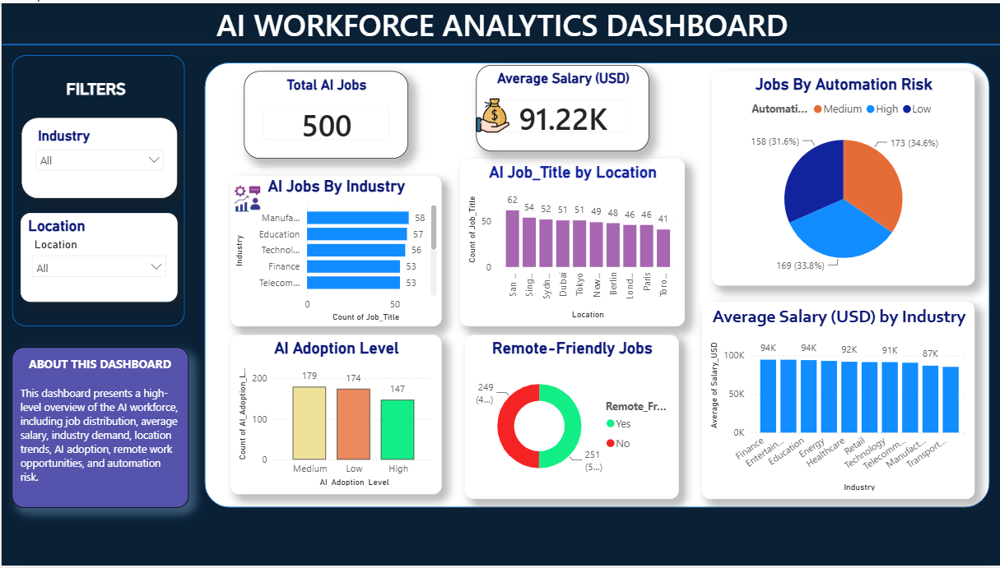
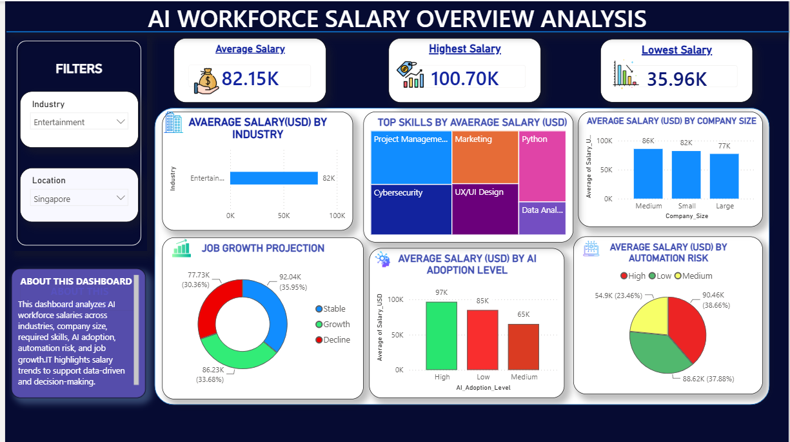
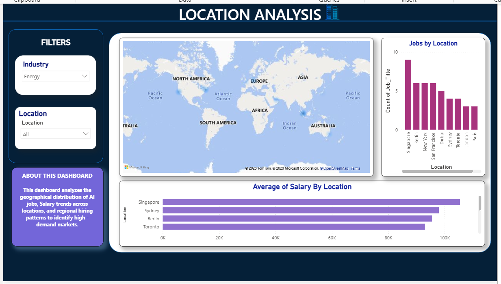
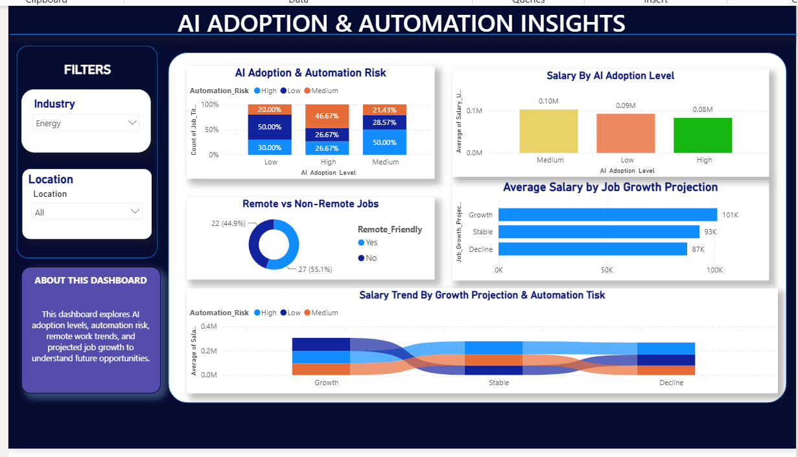

# 🤖 AI Adoption & Workforce Analytics Dashboard

An end-to-end Data Analytics project that analyzes AI workforce trends using **Excel, SQL, Python, and Power BI**. The project transforms raw job market data into interactive dashboards and actionable business insights.

---

# 📌 Project Overview

Artificial Intelligence is transforming industries across the world. This project explores how AI adoption impacts workforce trends by analyzing salary distribution, industry demand, automation risk, remote work opportunities, company size, and future job growth.

The project demonstrates the complete data analytics workflow—from data exploration and SQL analysis to Python EDA and Power BI dashboard development.

---

# 🎯 Objectives

- Analyze AI workforce trends across industries.
- Compare salary distribution across different factors.
- Study AI adoption and automation risk.
- Identify in-demand skills.
- Explore remote work opportunities.
- Build interactive Power BI dashboards for business decision-making.

---

# 📂 Dataset Information

- Dataset: AI Job Market Insights
- Total Records: **500**
- Total Features: **10**

### Attributes

- Job Title
- Industry
- Company Size
- Location
- Salary (USD)
- AI Adoption Level
- Required Skills
- Remote Friendly
- Job Growth Projection
- Automation Risk

---

# 🛠 Tools & Technologies

- 📊 Microsoft Excel
- 🗄 SQL
- 🐍 Python
- 📈 Power BI
- 💻 GitHub

Python Libraries

- Pandas
- NumPy
- Matplotlib

---

# 🔄 Project Workflow

Excel
↓
SQL
↓
Python (EDA)
↓
Power BI
↓
GitHub Portfolio

---

# 📊 Dashboard Preview

## Dashboard 1 – AI Workforce Analytics
Provides an overview of AI workforce trends, salary distribution, industry analysis, AI adoption, automation risk, and remote work opportunities.



---

## Dashboard 2 – AI Workforce Salary Overview
Analyzes salary trends across industries, company sizes, AI adoption levels, automation risk, and projected job growth.



---

## Dashboard 3 – Skills & Industry Analysis
Explores industry demand, required skills, salary distribution, remote work trends, and AI adoption across industries.


---

## Dashboard 4 – Location Analysis
Visualizes geographical distribution of AI jobs and compares salaries across different locations.



---

## Dashboard 5 – AI Adoption & Future Workforce Trends
Analyzes AI adoption, automation risk, remote work distribution, salary trends, and future workforce growth.



---

# 🔍 Key Insights

- Average salary across the dataset is approximately **USD 91,222**.
- Finance records the highest average salary among the industries analyzed.
- Organizations with **Low AI Adoption** have the highest average salary in this dataset.
- Remote-friendly and non-remote jobs are almost equally distributed.
- Job growth projections are balanced across Growth, Stable, and Decline categories.
- New York offers the highest average salary among the analyzed locations.

---

# 📁 Repository Structure

```text
AI-Adoption-Workforce-Analytics/
│
├── Dataset/
├── SQL/
├── Python/
├── POWER BI/
├── Screenshots/
├── Documentation/
└── README.md
```

---

# ▶️ How to Run the Project

1. Download or clone this repository.
2. Open the SQL folder to review business queries.
3. Run the Python notebook/script for EDA.
4. Open the `.pbix` file using Microsoft Power BI Desktop.
5. Explore the interactive dashboards using the filters and slicers.

---

# 🚀 Future Improvements

- Integrate real-time job market data.
- Add predictive analytics using Machine Learning.
- Publish dashboards using Power BI Service.
- Expand the analysis with additional countries and industries.

---

# 👩‍💻 Author

**Priya Vishwakarma**

Data Analytics Enthusiast

Tools: Excel | SQL | Python | Power BI | GitHub

---

⭐ If you found this project interesting, feel free to explore the dashboards and documentation.
